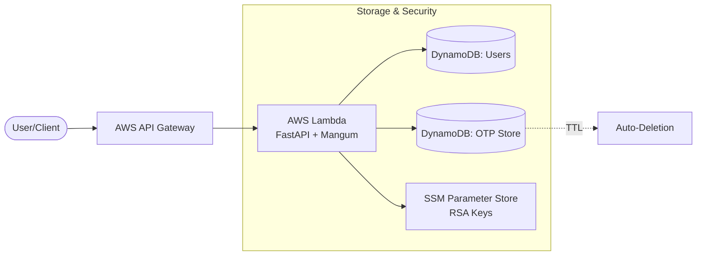
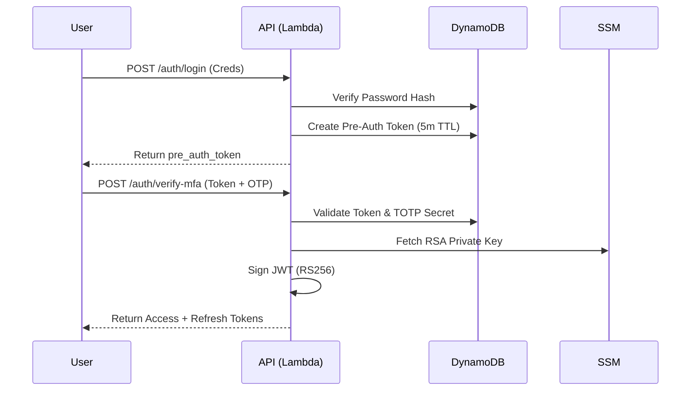

# Secure Serverless MFA API

A production-ready, cloud-native Multi-Factor Authentication (MFA) system built on AWS Serverless architecture. This project provides a robust API for user registration, TOTP (Time-based One-Time Password) enrollment, and secure two-step authentication using industry-standard RS256 JWTs.

## 🏗️ Architecture

The system utilizes a "Fat Lambda" pattern where a single FastAPI application handles all routing, wrapped by the Mangum adapter to interface with AWS Lambda and API Gateway.



### Flow Diagram: Two-Step Authentication



## 🛠️ Technology Stack

- **Framework**: [FastAPI](https://fastapi.tiangolo.com/) (High-performance Python web framework)
- **Serverless Bridge**: [Mangum](https://mangum.io/) (ASGI adapter for AWS Lambda)
- **Infrastructure**: [AWS SAM](https://aws.amazon.com/serverless/sam/) (Serverless Application Model)
- **Database**: [Amazon DynamoDB](https://aws.amazon.com/dynamodb/) (NoSQL, Pay-per-request billing)
- **Secrets Management**: [AWS SSM Parameter Store](https://docs.aws.amazon.com/systems-manager/latest/userguide/systems-manager-parameter-store.html) (Storing RSA Keys)
- **Authentication**:
  - `bcrypt`: Secure password hashing.
  - `pyotp`: TOTP generation and verification (Google Authenticator compatible).
  - `python-jose`: RS256 JWT signing and verification.
  - `qrcode`: QR code generation for easy mobile enrollment.

## 🚀 Getting Started

### Prerequisites
- AWS CLI configured with appropriate permissions.
- [SAM CLI](https://docs.aws.amazon.com/serverless-application-model/latest/developerguide/install-sam-cli.html) installed.
- Python 3.11+

### Deployment
1. **Initialize RSA Keys**: Generate an RSA key pair and store them in SSM Parameter Store at `/mfa/jwt/private_key` and `/mfa/jwt/public_key`.
2. **Build & Deploy**:
   ```bash
   sam build
   sam deploy --guided
   ```

## 🛣️ API Reference

### 1. User Registration
`POST /auth/register`
Initializes a user profile with a hashed password.
- **Request Body**: `{"username": "string", "password": "string"}`
- **Response**: `201 Created` - `{"msg": "Registered. Enroll TOTP next..."}`

### 2. MFA Enrollment
`POST /auth/enroll-totp`
Generates a unique TOTP secret and QR code.
- **Request Body**: `{"username": "string", "password": "string"}`
- **Response**: `200 OK` - `{"qr_base64": "...", "secret": "...", "instructions": "..."}`
- **Note**: The QR code can be scanned by any Authenticator app (Google, Microsoft, Authy).

### 3. Primary Authentication (Step 1)
`POST /auth/login`
Verifies password and issues a temporary session token.
- **Request Body**: `{"username": "string", "password": "string"}`
- **Response**: `200 OK` - `{"pre_auth_token": "...", "next": "...", "expires_in_seconds": 300}`
- **Security**: The `pre_auth_token` is single-use and expires in 5 minutes via DynamoDB TTL.

### 4. MFA Verification (Step 2)
`POST /auth/verify-mfa`
The final step to receive production JWTs.
- **Request Body**: `{"pre_auth_token": "string", "totp_code": "string"}`
- **Response**: `200 OK` - `{"access_token": "...", "refresh_token": "...", "token_type": "bearer"}`

---

## 🔒 Security & Design Choices

### Why RS256 over HS256?
While the local prototype used symmetric HS256 (same key for sign/verify), this cloud version uses **RS256 (Asymmetric)**. 
- **Sign with Private Key**: Only the Lambda function can issue tokens.
- **Verify with Public Key**: Any downstream microservice can verify the token's authenticity using the public key from SSM, without needing the secret signing key.

### Session Management (DynamoDB TTL)
The `MfaOTPStoreTable` uses DynamoDB's native **Time To Live (TTL)** feature. 
- Pre-auth tokens are automatically deleted by AWS after 5 minutes.
- This reduces storage costs and automatically cleans up abandoned login attempts without manual cron jobs.

### Secret Management
RSA keys are stored in **AWS SSM Parameter Store** with encryption enabled. This prevents hardcoding secrets in the codebase or environment variables.

---

## 💻 Local Development & Testing

You can run the entire cloud stack locally using SAM's emulation features.

1. **Start API Locally**:
   ```bash
   sam local start-api
   ```
2. **Invoke Function Directly**:
   ```bash
   sam local invoke FastAPIFunction -e events/event.json
   ```
3. **Load Testing**:
   A K6 load test script is provided in [`load_test.js`](./load_test.js) to stress test the API Gateway and Lambda concurrency.

---

## ❓ Frequently Asked Questions (FAQ)

**Q: Why use a "Fat Lambda" instead of multiple Lambda functions?**
**A:** Using a single Lambda with FastAPI and Mangum simplifies development, allows for local testing as a standard Python app, and reduces the complexity of managing multiple API Gateway integrations. It's ideal for prototypes and medium-scale APIs.

**Q: How does the system handle "Clock Drift" for TOTP?**
**A:** The `pyotp` verification uses `valid_window=1`, which allows the code from the previous or next 30-second window to be accepted. This accounts for small timing differences between the user's phone and the AWS server.

**Q: Is DynamoDB expensive for this use case?**
**A:** No. By using `PAY_PER_REQUEST` billing mode, you only pay for actual registrations and logins. For a prototype or low-traffic application, this usually stays within the AWS Free Tier.

**Q: Can I use AWS Cognito instead of this custom system?**
**A:** Yes, Cognito is a managed alternative. This project is intended for cases where you need **complete control** over the authentication flow, database schema, or need to avoid Cognito's specific pricing/limitations.

**Q: How do I rotate the JWT RSA keys?**
**A:** Simply update the parameters in SSM. However, note that tokens signed with the old private key will fail verification against the new public key. A graceful rotation strategy would involve checking against both keys for a short period.

---

## 🔄 Evolution from Local Prototype

This project is the cloud-production evolution of the initial local prototype found in [`./prototype/`](../prototype/).

### Key Improvements:

| Feature | Local Prototype (`./prototype/`) | Cloud Prototype (`./cloud_prototype/`) |
| :--- | :--- | :--- |
| **Persistence** | In-memory Python Dictionaries (lost on restart) | **Amazon DynamoDB** (Scalable & Persistent) |
| **Token Security** | **HS256** (Symmetric - same key for sign/verify) | **RS256** (Asymmetric - Public/Private key pair) |
| **Secrets** | Hardcoded/Ephemeral | **AWS SSM Parameter Store** (Secure & Managed) |
| **Scalability** | Single-instance (Uvicorn) | **Serverless (Lambda)** (Auto-scaling to demand) |
| **Cleanup** | Manual management | **DynamoDB TTL** (Automatic deletion of expired sessions) |
| **Code Structure** | Monolithic script | **Infrastructure as Code (SAM YAML)** |

The local version was instrumental for rapid logic validation, while the cloud version focuses on security, availability, and production-grade architecture.
