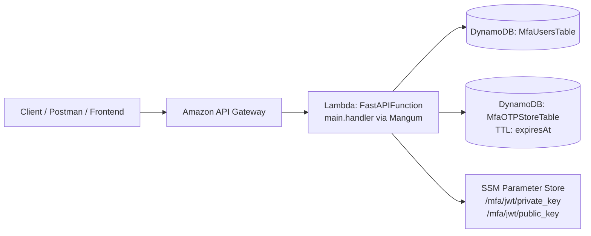

# Cloud Prototype – Serverless MFA API

This folder contains the **cloud-ready MFA API** implemented as a **serverless FastAPI application** on AWS using the **Fat Lambda pattern** (FastAPI + Mangum). It provides password registration, TOTP enrollment, MFA verification, and JWT-based access.

## Architecture

### High-level diagram (Mermaid)



### Component summary

- **API Gateway**: Receives HTTP requests and forwards them to Lambda.
- **Lambda (FastAPIFunction)**: Runs FastAPI through `Mangum` to handle all routes.
- **DynamoDB – MfaUsersTable**: Stores user credentials and TOTP enrollment state.
- **DynamoDB – MfaOTPStoreTable**: Stores short-lived pre-auth tokens with TTL cleanup.
- **SSM Parameter Store**: Stores RSA keys for RS256 JWT signing and verification.

## Directory contents

- `main.py` – FastAPI app, auth flow, JWT issuance/validation, DynamoDB access, Mangum handler
- `template.yaml` – AWS SAM template defining Lambda, API Gateway, tables, and IAM
- `requirements.txt` – Python dependencies for Lambda packaging
- `samconfig.toml` – Default SAM deployment parameters
- `load_test.js` – k6 load test for the registration endpoint

## API flow

1. **Register** – `POST /auth/register`
2. **Enroll TOTP** – `POST /auth/enroll-totp`
3. **Login** – `POST /auth/login` (returns `pre_auth_token`)
4. **Verify MFA** – `POST /auth/verify-mfa` (returns JWTs)
5. **Profile** – `GET /api/profile` (requires `Authorization: Bearer <token>`)

## Endpoints

### `POST /auth/register`
Registers a user with username/password.

### `POST /auth/enroll-totp`
Validates credentials, generates a TOTP secret, and returns a QR code in base64.

### `POST /auth/login`
Validates credentials and returns a short-lived `pre_auth_token`.

### `POST /auth/verify-mfa`
Verifies TOTP code and returns JWT access + refresh tokens.

### `GET /api/profile` (Protected)
Validates RS256 JWT using the public key from SSM.

### `GET /api/health`
Basic health check.

## Security model

- Passwords are hashed with **bcrypt**.
- MFA is enforced before JWT issuance.
- JWTs use **RS256** with RSA keys stored in SSM.
- Pre-auth tokens are **short-lived** and **single-use**.
- OTP session storage uses DynamoDB TTL (`expiresAt`).

## Setup and deployment

### Prerequisites

- AWS account with CLI configured
- AWS SAM CLI installed
- Python 3.11 for local SAM build
- OpenSSL for RSA key generation

### Generate RSA keys

```bash
openssl genrsa -out private_key.pem 2048
openssl rsa -in private_key.pem -pubout -out public_key.pem
```

### Store keys in SSM

```bash
aws ssm put-parameter \
  --name "/mfa/jwt/private_key" \
  --value "$(cat private_key.pem)" \
  --type "SecureString"

aws ssm put-parameter \
  --name "/mfa/jwt/public_key" \
  --value "$(cat public_key.pem)" \
  --type "String"
```

### Build and deploy with SAM

```bash
cd cloud_prototype
sam build
sam deploy --guided
```

SAM outputs `ApiUrl` after deployment, which you can use for all requests.

## Load testing

`load_test.js` uses k6 to register users at high concurrency.

```bash
k6 run load_test.js
```

> Update the hardcoded API URL in `load_test.js` before running.
